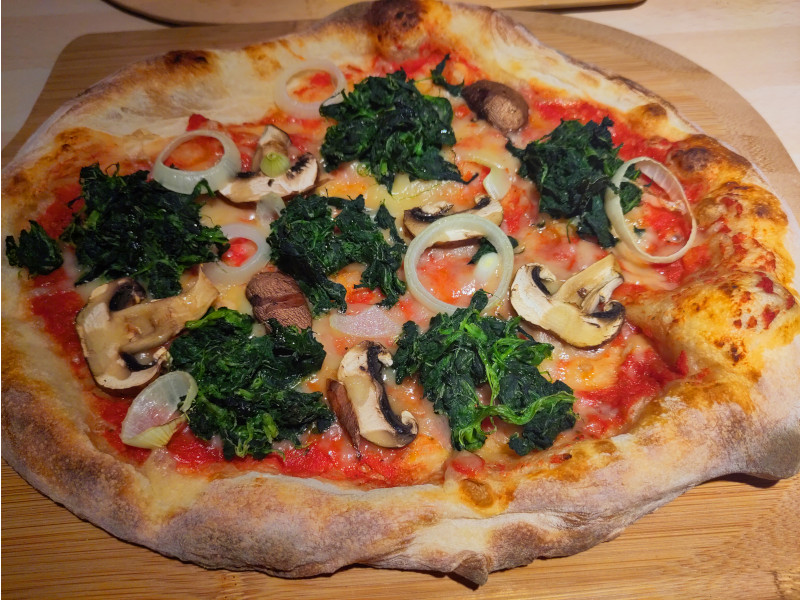
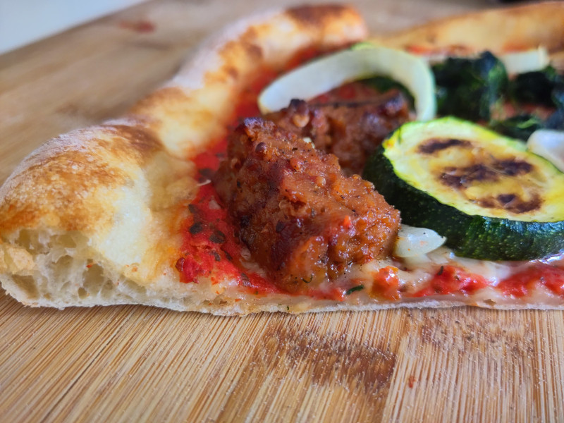

# Pizza

## Dough for a domestic home oven

* 1 kg pizza flour
* 650 ml cold water
* 20g of salt
* 1-2g fresh yeast
* 20g olive oil

This recipe assumes that you are using normal pizza flour. If you are using Caputo Pizzeria flour see recipe below.

Traditionally everything is mixed using your hands.

First mix the salt into the water, than mix 10% (50g) of the flour into it.

Now insert the yeast (use 2g if it's cold and 1g if it's hot) and mix until it has vanished.

Afterwards put some flour into the water and stir until it has combined with the rest. Do so with the left over flour until a firm dough has been formed and all flour got absorbed.

Pour the olive oil over the dough, cover it and let it sit for 10-15 minutes.

Now you work the dough until the olive oil has nearly been absorbed and until you can press it and it comes up immediately.

Let it rest again for at least 16 better 24 hours in a warm spot.

Form 6 pizza balls and let them rest again for at least 1 better 2-3 hours.

Preheat the oven at max temparature (e.g. 275C)

Press and form it to a round pizza and put 1-2 Tbsp of pizza sauce onto it.

Transfer the pizza dough on the back of your hands onto a baking paper on the grate, put tomato sauce on top and prebake it for three minutes on the lowest rack. If you are using a pizza stone or -steel prebake it for two miniutes.

Get the pizza out, put the cheese and other ingredients on top, drizzle some olive oil over it and bake it for another 5 minutes without the baking paper on the highest rack or 4:30 minutes on a pizza stone or -steel.

## Dough with Caputo Pizzeria flour

* 1 kg Caputo Pizzeria flour
* 625 ml cold water
* 20g of salt
* 1-2g fresh yeast

Traditionally everything is mixed using your hands.

First mix the salt into the water, than mix 10% of the flour into it.

Now insert the yeast (use 2g if it's cold and 1g if it's hot) and mix until it has vanished.

Afterwards put some flour into the water and stir until it has combined with the rest. Do so with the left over flour until a firm dough has been formed and all flour got absorbed.

Cover it and let it sit for 15 minutes. Now wet your hands and fold the dough several times to give it a smooth surface.

Let it rest covered for aproximately an hour until it has doubled in size. 

Form 6 pizza balls, place them into a pizza container and let them rest again for one hour until they also have doubled in size. 

Now put the container in the fridge at least over night better for 24 hours. Get it out 2-3 hours before you want to bake them depending on the temparature in your flat.

If necessary (if the dough balls are not really round anymore) reball them and let them sit for an hour.

Preheat the oven at max temparature (e.g. 275C)

Press and form it to a round pizza and put 1-2 Tbsp of pizza sauce onto it.

Prebake the pizza for 2 minutes on a pizza stone or -steel. 

Than put the cheese and other ingredients on top, drizzle some olive oil over it and bake for another 4 minutes.

## Pizza sauce

* 1 can peeled tomatos (chopped if you cant get peeled)
* 1 pinch of salt
* Fresh basil (optional)
  Or
* Oregano (optional)

Puree the tomatos using a handblender, add a pinch of salt and basil or oregano if you like. 

If the mixture is too watery add some tomato puree to make it a slightly thick sauce.

Do not cook the sauce as it will cook in the oven.

Traditionally peeled tomatos are crushed by hand.
